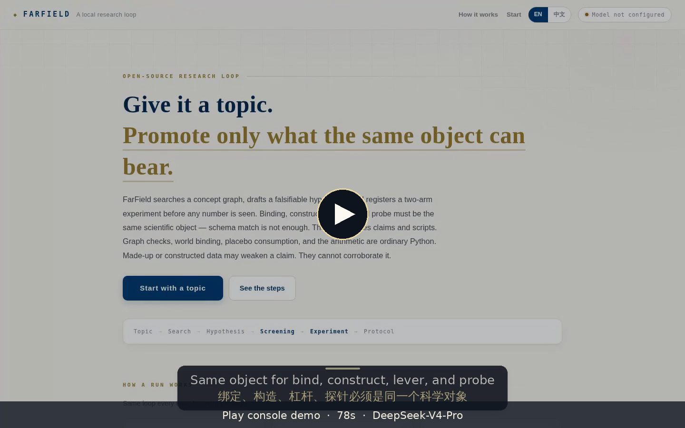
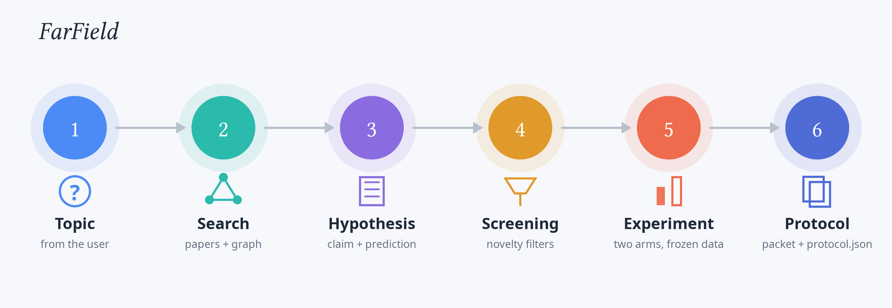

<div align="center">

# FarField

**Explore far. Promote only what the same scientific object can bear.**

A local research loop for automated scientific inquiry: far-field search, registered two-arm experiments, and an evidence contract the language model cannot rewrite.

[English](README.md) · [简体中文](README.zh-CN.md) · [Citation](#citation)

[](https://www.python.org/downloads/)
[](LICENSE)
[](https://github.com/123zgj123/FarField/actions/workflows/tests.yml)
[](pyproject.toml)

[Guijia Zhang](https://123zgj123.github.io)

</div>

## News

- **2026.09** — Spray stops on `plan_executable` (a compiled brief+plan the intern can run), not on a discovery. `SYNTHETIC` / `GENERATED` supports can close spray; they still cannot corroborate, distill, or promote. After diagnosis, `--world-sim` (default on) rehearses the plan; a structural hole spends one same-pair compile refine before the first probe. `--host-execute` is on by default and records `protocol_executed` — that is not a finding. Far-field search remains a heuristic: the archived negative result still stands (post-T realization is not above matched random).
- **2026.08** — Evidence contract: only an attested `WORLD` probe may corroborate. A catalog miss is diagnosed and wait-listed; schema hints cannot bind a cousin freeze. Per-idea working memory stays on that concept pair.
- **Demo video** — A console walkthrough will be uploaded separately. The poster below is a placeholder.

<p align="center">
  <a href="demo.html">
    
  </a>
</p>

## Start here

| You want to… | Go to |
|---|---|
| Understand the scientific contract | [Why FarField](#why-farfield) and [Evidence contract](#evidence-contract) |
| Install and run a mission | [Install](#install) and [Quick start](#quick-start) |
| Open the local console | [Console](#console) |
| Rerun a compiled protocol | [Execute a protocol](#execute-a-protocol) |
| Cite the software | [Citation](#citation) |

## Abstract

Automated research systems can now draft plausible ideas, experiments, and paper-shaped text. The open problem is not generation. It is **when an AI-produced result should be believed**.

FarField is an inspectable local loop. Given a topic, it recovers development trajectories from verified papers and makes far-field jumps, proposes a falsifiable hypothesis, **registers a two-arm experiment before any number is observed**, and emits a protocol another researcher can rerun. The model may write the claim, the mechanism, and the script. Graph checks, prior-art checks, world binding, and treatment–control arithmetic are ordinary Python — the model does not sit on those gates.

A confirmation is allowed only when **binding, construction, lever, and probe measure the same scientific object**. Schema match is not scientific match. Synthetic or constructed data may weaken a hypothesis. They cannot corroborate it.

The finish line is not a conference PDF. It is a research packet.

## Why FarField

Three failure modes are easy to introduce in auto-research:

1. the model's explanation is treated as evidence for its own hypothesis;
2. an experiment is rewritten after the numbers are seen;
3. a claim is “confirmed” on data created for that claim.

FarField is built around a stricter rule:

> **Explore broadly; promote conclusions conservatively.**

Search may be speculative. Evidence may not. Ranking, Elo, and reviewer scores are recorded colleague opinions. They cannot accept, reject, or promote a scientific result.

<p align="center">
  
</p>

## Research loop

| Stage | What happens |
|---|---|
| **Search** | The topic becomes a research position; verified papers recover development trajectories; a far jump applies an observed move to the current position. The concept graph is a scout / baseline / continue oracle and does not mint `pair[1]`. Distance is a search heuristic, not a novelty proof. |
| **Hypothesis** | The model writes a claim, mechanism, prediction, and a discarded approach. These fields are proposals, not evidence. |
| **Screening** | Deterministic graph and text checks refuse already-known pairs and structurally weak claims. |
| **Prior art** | Retrieved literature can close a claim (`closed_by_prior`) before compute is spent rediscovering it. |
| **Compile** | Same pair, same freeze. Text-gate deaths and `no_handle` rewrite in `idea_rounds` (product: up to two). A world-sim structural hole spends one compile refine, then re-registers the diagnosis. Not a new far jump. |
| **Registration** | Competing explanation, arms, metric, expected direction, and compute tier are fixed before execution. |
| **Experiment** | Both arms call the same `measure`; they differ only by a mechanism flag. Product `experiment_rounds=-1` allows two extra attempts after the first registered run. |
| **Evidence** | `supports` / `weakens` / `uninformative` are scientific. Timeouts and missing files are not. A 20s WORLD `supports` is speculative until the host reruns the same EvidenceID. |
| **Packet** | Complete research plan in `RESEARCH_PACKET.md` (Chinese) and `RESEARCH_PACKET_EN.md` (English), with claim, literature, experiment design, and next steps in the file. Each live idea also has `ideas/<idea-name>/` (bilingual brief + plan), `AGENT_PACKET.md` (execute order), and `protocol.json`. Weakened or unrunnable cards do not occupy `ideas/`. |

Far-field spray stops when the **plan is executable**: a WORLD support, an uninformative or SYNTHETIC / GENERATED support with a compiled brief+plan, a neighbourhood line that already has that plan, or the jump cap. Remaining work is `farfield execute`, not another `farfield research`. An executable SYNTHETIC plan is a finished coherence check — go freeze — not a discovery.

## Evidence contract

```text
synthetic / generated result
        |
        +-- weakens    →  scientific negative evidence
        |
        +-- supports   →  coherence check, not confirmation
```

| Kind | Meaning |
|---|---|
| `WORLD` | Attested fixture copied into `data/` and actually read by the script. May climb after a matching host EvidenceID with an isolated mechanism. |
| `GENERATED` | Constructed for this registration. May weaken; cannot corroborate, distill, or promote. An executable plan **does** stop spray. |
| `SYNTHETIC` | Invented coherence check. Same asymmetry: can stop spray, cannot become a finding. |
| `WORLD_SIM` | Idea rehearsal (`farfield world-sim`, default on). Imagined best / median / worst. Can rewrite plan structure. Cannot climb, cannot make a claim true, cannot block `farfield execute`. |

`--world auto` constructs one GENERATED world from the **task topic** and papers this mission already retrieved. It does **not** auto-bind Pride, phage, A2A, or any other catalog cousin. Schema hints cannot bind a freeze. Explicit `--world <id>` is the only catalog bind on the product path. A miss is `WORLD_INCOMPATIBLE` for verification (never a silent substitute). The constructed probe can weaken; it cannot corroborate. Forward simulation steps the registered lever until absorbing, plateau, or horizon. Its analysis is idea analysis. It cannot climb the ladder.

Three uses of “world” stay distinct: the **fixture** (`worlds/` via explicit `--world <id>`, and `workspace/world/` for the constructed instance), **dynamics** (`dynworld` levers on evolving state), and **idea rehearsal** (`ideas/<name>/world-sim/`, `farfield world-sim`). Rehearsal reads brief + plan + retrieved papers. It does not require a catalog freeze or a compiled lever. Imagined numbers cannot corroborate, rewrite `expected_direction`, or block `farfield execute`.

Working memory (H) upgrades **the same concept pair**. Distilled skills stay under `candidates/<card_id>/skills/`. Trusted `plugin.py` in the repo is the only shared capability.

Confirmation is fail-closed. A missing digest, a missing EvidenceID, or an incomplete protocol is a refusal. `farfield execute` / default `--host-execute` records `protocol_executed`; that is not a discovery. Most topics still land on `SYNTHETIC` or `GENERATED` because the catalog is thin — a miss is `WORLD_INCOMPATIBLE` (wishlist), never a silent substitute.

## Install

Requires Python 3.11+. The core runtime and tests use the standard library only.

```bash
git clone https://github.com/123zgj123/FarField.git
cd FarField
```

There is nothing to install with `pip`. Add `src/` to `PYTHONPATH`.

```bash
PYTHONDONTWRITEBYTECODE=1 PYTHONPATH=src python3 -m unittest discover -s tests -q
```

Tests do not need an API key. A clone includes `concepts/attn-concepts-s1/` (~8 MB), enough to run the loop. Larger graphs exceed GitHub's file limit; rebuild from recorded pages with `python3 scripts/build_concepts.py --replay` when you have them.

## Quick start

The CLI currently has two paths. Default OpenWorld runs the local controller and exploratory observations, writing `SCIENTIFIC_STATE.json`, `SCIENTIFIC_EVENTS.json`, and `RESEARCH_STATUS.md`. General LLM retrieval, experiment compilation, and research packets are not connected to this path yet. Its final event reports `research_complete: false`. Model, API budget, review, and `--state-store` options currently apply to `--legacy-pipeline`.

Check real frozen data without an API:

```bash
PYTHONDONTWRITEBYTECODE=1 PYTHONPATH=src python3.11 -m farfield research /tmp/farfield-iris \
  --topic "Does sepal geometry predict iris species?" --world fisher-iris --horizon 4
```

Explicit world ids load and validate the manifest and recorded digest, then copy the original bytes. Missing ids fail. Default `auto/none` does not invent contrast observations; unavailable acquisition recipes remain capability gaps. Builtin table, graph, and sequence summaries are exploratory and leave the scientific question open. Generated data and its descendants cannot become WORLD evidence.

For the literature, candidate, review, registered experiment, and research packet workflow described below, use `--legacy-pipeline` with a configured model:

```bash
mkdir -p ~/.config/farfield
chmod 700 ~/.config/farfield
# write the provider key, then:
chmod 600 ~/.config/farfield/llm.key

export FARFIELD_LLM_KEY_FILE=$HOME/.config/farfield/llm.key
export FARFIELD_LLM_BASE_URL=https://api.deepseek.com/v1
export FARFIELD_LLM_MODEL=deepseek-v4-pro

PYTHONPATH=src python3.11 -m farfield research /tmp/farfield-research --legacy-pipeline \
  --topic "compress genomic sequence collections with succinct data structures"
```

To continue a scientific line, reuse the same `--state-store` and `--world`. A new mission folder is an audit trail, not a new identity. Do not commit API keys or pass them on the command line. See `.env.example`.

### Console

```bash
PYTHONPATH=src python3 scripts/console.py
```

Then open `http://localhost:8765/`. The console binds to `127.0.0.1` by default. Prefer SSH forwarding for remote access.

### Execute a protocol

```bash
PYTHONPATH=src python3 -m farfield execute /path/to/candidate-folder --on-slice
```

`research` product defaults after the cwm-iclr2027 audit: `--min-ideas 3` (breadth floor: an executable plan does not stop the spray before three distinct landings), DV sanity (a measure of an oracle-relative quantity that does not move when the oracle field is permuted is `object_absent`, not `uninformative`), schema tier floors (`program_state` / `labeled_traces` → `host-heavy`, pre-registered before any probe), object-property binding (`object_properties` on manifests vs the claim's stated properties), builtin exploratory descriptives on any acquired world (`farfield analyze`, labelled `cannot_corroborate`), `--human-gate after_review` + `--approve`, and resume-by-replay (rerun the same command; recorded steps replay). `--on-slice` reruns the probe bytes (E1). Default `execute` rebuilds the attested parent (E2) when the freeze cache exists. Other commands: `freeze` (also `--derive-from <world>` and `--dir <run> --format dgm|openevolve`), `analyze`, `harvest` (run a harness under a pre-registered recipe and freeze its history as `provenance: harvested`), `paper` (write the paper-level `RESEARCH_PROPOSAL.md` / `EXPERIMENT_DESIGN.md` for an idea from its attested fact sheet, with one reviewer round; DRAFT, citations audited — also `research --paper-rounds`), `run`, `attest-run`, `campaign`, `world-sim`. See `python3 -m farfield --help`.

## Outputs

These are `--legacy-pipeline` outputs. Default OpenWorld outputs are listed in Quick start.

```text
RESEARCH_PACKET.md      complete research plan (Chinese; experiment design inlined)
RESEARCH_PACKET_EN.md   English copy of the same plan
ideas/<idea-name>/      one folder per live idea (named by core content, not gen_ digest)
  README.md            this folder's map
  idea-stage/RESEARCH_BRIEF.md     complete research plan (Chinese)
  idea-stage/RESEARCH_BRIEF_EN.md  English copy
  refine-logs/EXPERIMENT_PLAN.md   complete experiment design (Chinese)
  refine-logs/EXPERIMENT_PLAN_EN.md English copy
  AGENT_PACKET.md      execute order, this card only
  world-sim/           idea rehearsal (imagined; cannot climb)
protocol.json          registered experiment
experiment.py          two-arm script
metrics.json           treatment / control
evidence_snapshot/     frozen retrieval used this run
```

Mission state lives under `var/` and is gitignored.

## Repository

```text
src/farfield/       core runtime
tests/              stdlib unittest
worlds/             attested fixtures
corpora/            citation-graph assets
concepts/           concept co-occurrence graphs
scripts/            console and rebuild
examples/           small ledger examples
webui/              local console
assets/             figures
.agents/skills/     trusted research hooks
```

The public tree is the runtime, tests, small replayable assets, and fixtures. Keys, mission folders, and internal design notes are not included.

## Status

FarField is an experimental research system. The repository makes the loop and its failure modes inspectable; it is not a finished autonomous scientist, and it has not shown that far-field search beats a matched random draw.

- The archived negative result still stands: far-jump post-T realization is not above matched random; later evolution generations did not reverse it. Distance is a search heuristic, not novelty.
- A cheap WORLD `supports` is a filter (`speculative`). `corroborated` needs the host to rerun the same EvidenceID with the mechanism isolated.
- Most topics still land `SYNTHETIC` / `GENERATED`. One SYNTHETIC support correctly stops spray; scientifically that only means the coherence check is done — freeze next.
- `world-sim` can change plan structure. It cannot change what is true. Rehearsal failure must not block execute.
- Refine budgets are short on purpose: text at most two extra drafts; experiments at most two extra attempts; one compile rewrite when rehearsal names a hole. A second uninformative result switches the lever — that is discipline, not a deep search.
- Catalog coverage is still thin. Unmatched objects go to the wishlist; they are not silently bound to a cousin freeze.

## Citation

If you use FarField in research, please cite [`CITATION.cff`](CITATION.cff).

## License

MIT. See [LICENSE](LICENSE).
